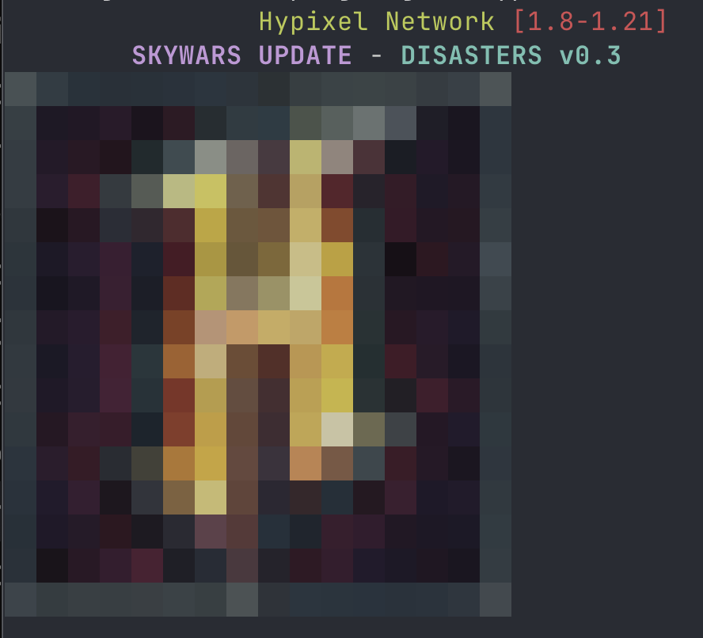

# mcping-zig

This program allows you to "ping" Minecraft multiplayer servers on your command line.

The "ping" from a Minecraft server gives back data like: MOTD, players online, favicon, and more.

